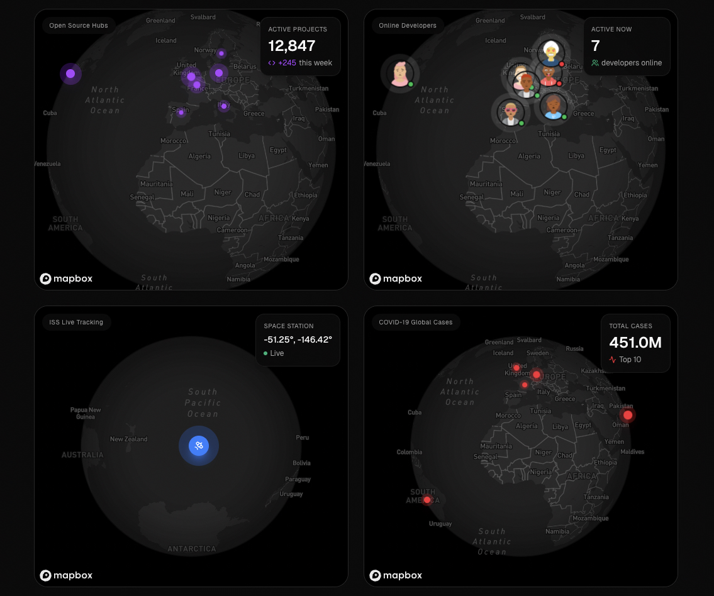

  <h1>Terrae</h1>
  
<strong>Map library for Design Engineers</strong>

  

    Beautiful map components built with React, TypeScript, Tailwind CSS, Mapbox GL JS, and MapLibre GL. 
    Perfect companion for shadcn/ui.
  

 

  

---

## Documentation

Visit [www.terrae.dev](https://www.terrae.dev) to view the full documentation.

## Contributing

Please read our [Contributing Guide](CONTRIBUTING.md) to learn how you can help.

## License

Licensed under the [MIT License](LICENSE).
